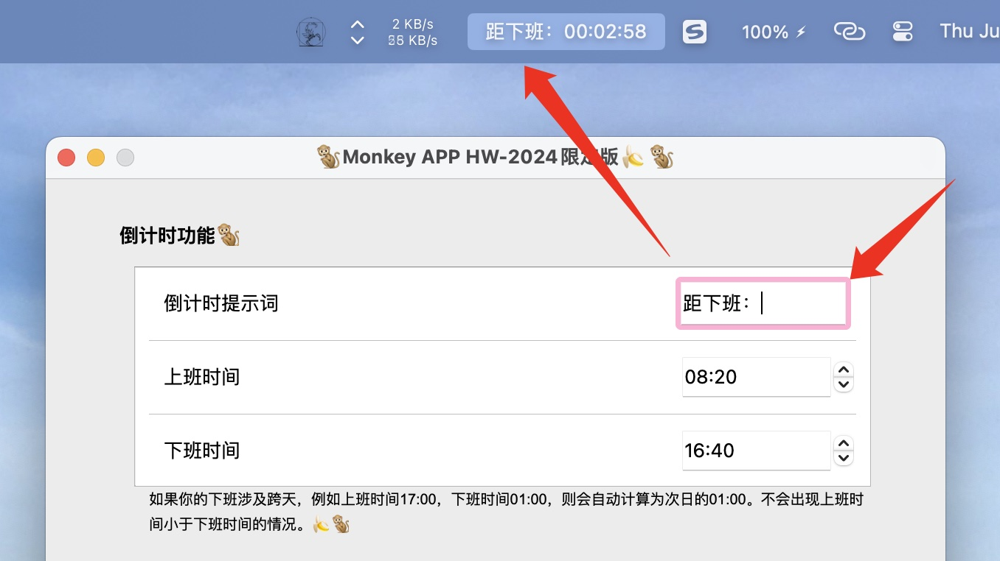

# MonkeyApp
Monkey App - 在Mac状态栏显示蓝队吗喽们的下班倒计时


## update

### 20240730
修复Issue # 7：
```angular2html
WARNING: Secure coding is automatically enabled for restorable state! However, not on all supported macOS versions of this application. Opt-in to secure coding explicitly by implementing NSApplicationDelegate.applicationSupportsSecureRestorableState:.
```

## 反馈
如果你有想要的新功能或Bug反馈，请提Issue或联系：


### 实时倒计时
在状态栏显示下班倒计时

### 摸鱼百分比
在状态栏实时显示当前已上班时间百分比

### 摸鱼收入
在状态栏实时显示当天已获得的摸鱼收入，看着每秒增加的收入封起 IP 来更有动力！！！

# 怎样使用
## 1. 安装第三方模块
### rumps
rumps 是一个 Python 模块，用于创建 Mac OS X 应用程序。它提供了一个简单的方式来创建带有菜单栏图标的应用程序。
```bash
pip3 install rumps
```

### PyQt5
PyQt5 是一个用于创建跨平台桌面应用程序的 Python 绑定库，它提供了对 Qt 应用程序框架的访问。
```bash
pip3 install PyQt5
```


### 或者一键安装所需模块：

```bash
pip3 install -r requirements.txt
```

## 2. 开始运行

```bash
python3 monkey.py &
```


开始运行后即可获得一个位于Mac状态栏的倒计时程序


## 自动退出问题 <a href="https://github.com/garfield-ts">@garfield-ts</a>
如果你使用Mac自带的终端，或你的终端设置为关闭当前会话后关闭进程，则需要使用nohup来运行。

```bash
nohup python3 monkey.py &
```

这是因为使用终端运行时，你的Monkey APP是终端启动的，此时终端进程是Monkey APP的父进程。
在Linux/Unix系统中，当终端关闭后，Monkey APP进程作为终端进程的子进程也会被自动关闭。

使用nohup可以忽略操作系统的SIGHUP信号，实现父进程消失后，在该父进程中启动的子进程继续运行的效果。

## 3. 设置相关参数
单击状态栏中的 设置 菜单，打开设置页面：


在设置界面中填写你实际上下班时间等信息：


### 倒计时提示词
会显示在倒计时前，例如设置为："距下班："，则显示效果如下：



### 禁用倒计时提示词
提示词为空则不显示提示词

### 百分比提示词
会显示百分比前，例如设置为："已上班："，则显示效果如下：


### 禁用百分比提示词
提示词为空则不显示提示词

### 日薪提示词与日薪符号
日薪提示词会显示日薪前，例如设置为："已赚取："，日薪符号会显示在日薪提示词之后，日薪数字之前，作为日薪的符号，例如设置为："￥"，则显示效果如下：


### 禁用日薪提示词与日薪符号
提示词或符号为空则不显示提示词或符号

## 4. 怎样退出
单击状态栏倒计时区域即可退出


